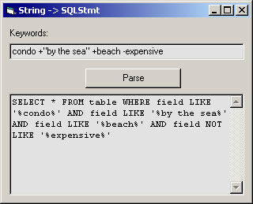



## Convert language query string into SQL statement

### Description

"PARSE" function converts search string (like in altavista/with pluses, minuses and quotations) into SQL query string for database search. To make this work in your database, you need to replace "table" and "field" words with appropriate values for your database. It's done in VB6 but will work in other versions as well.
 
### More Info
 

             |
---                |---
**Submitted On**   |2001-11-18 12:19:40
**By**             |[Hrvoje Delac](https://github.com/Planet-Source-Code/PSCIndex/blob/master/ByAuthor/hrvoje-delac.md)
**Level**          |Beginner
**User Rating**    |4.8 (24 globes from 5 users)
**Compatibility**  |VB 3\.0, VB 4\.0 \(16\-bit\), VB 4\.0 \(32\-bit\), VB 5\.0, VB 6\.0, ASP \(Active Server Pages\) 
**Category**       |[String Manipulation](https://github.com/Planet-Source-Code/PSCIndex/blob/master/ByCategory/string-manipulation__1-5.md)
**World**          |[Visual Basic](https://github.com/Planet-Source-Code/PSCIndex/blob/master/ByWorld/visual-basic.md)
**Archive File**   |[Convert\_la3587211182001\.zip](https://github.com/Planet-Source-Code/hrvoje-delac-convert-language-query-string-into-sql-statement__1-28980/archive/master.zip)

